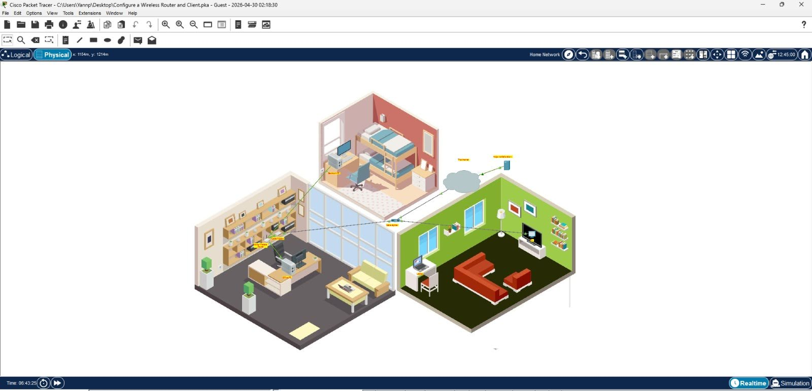
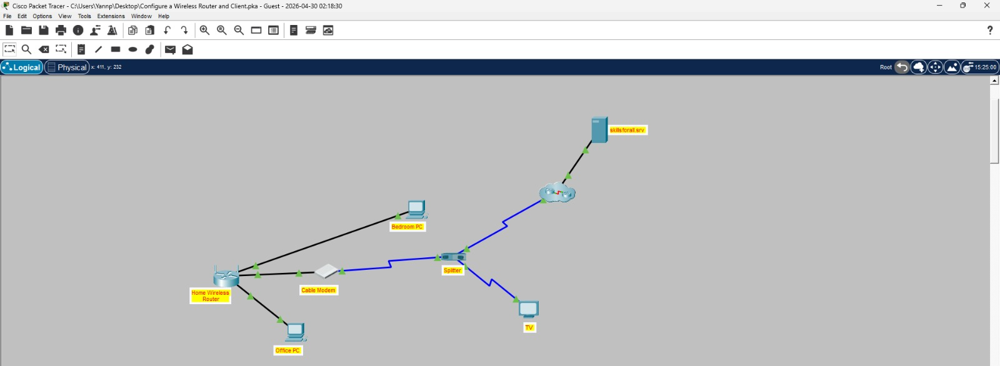
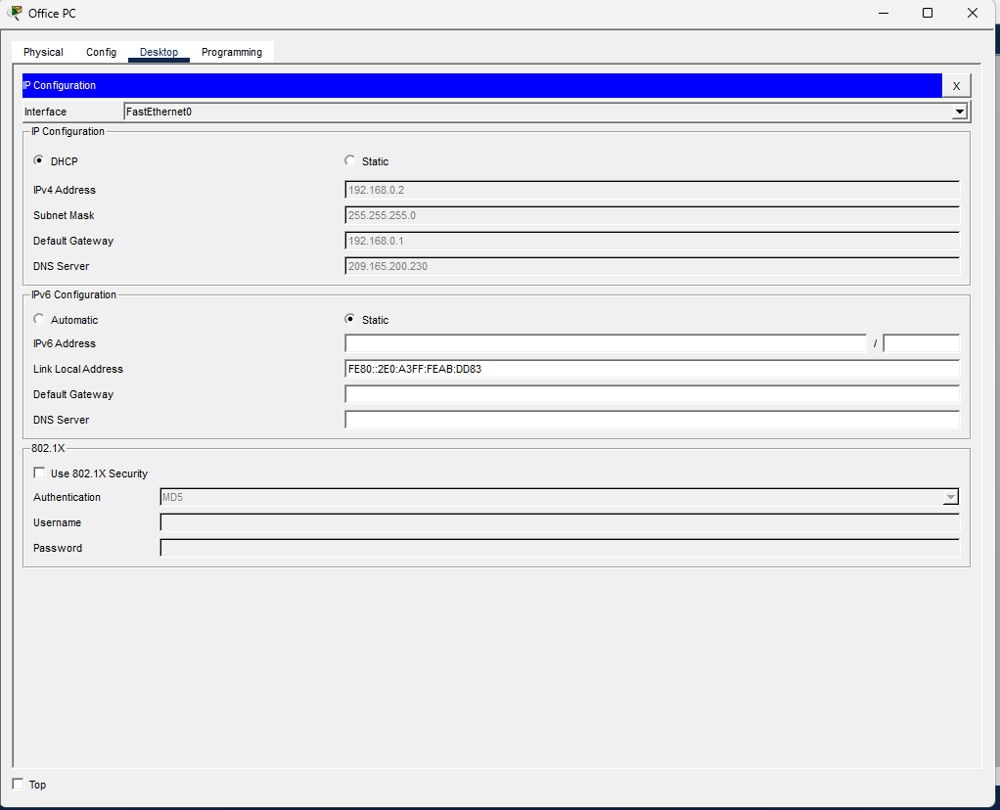
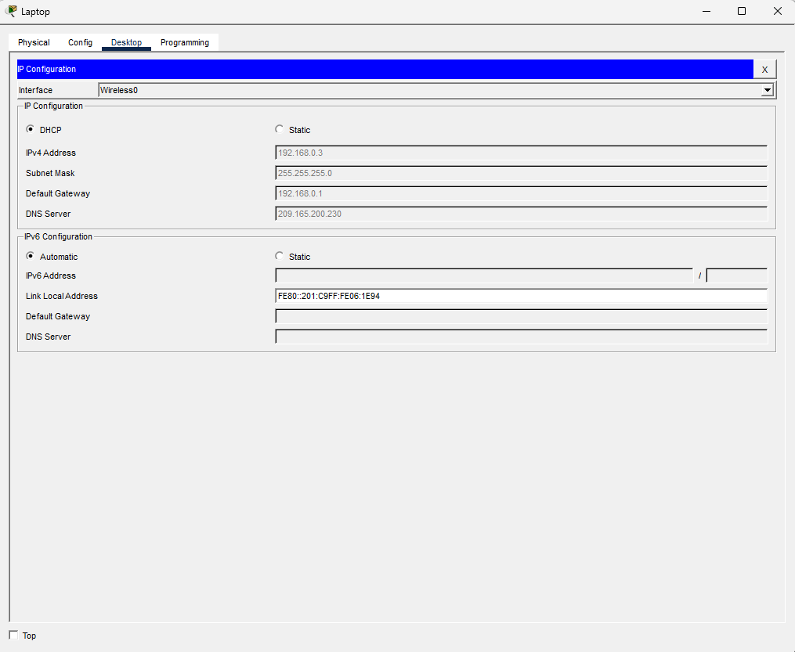
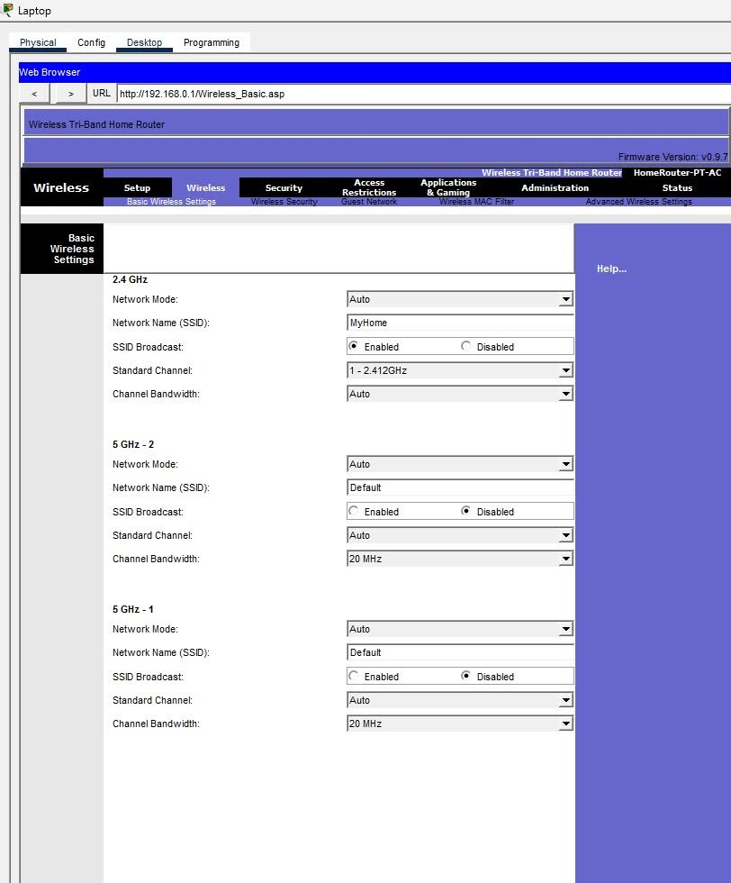
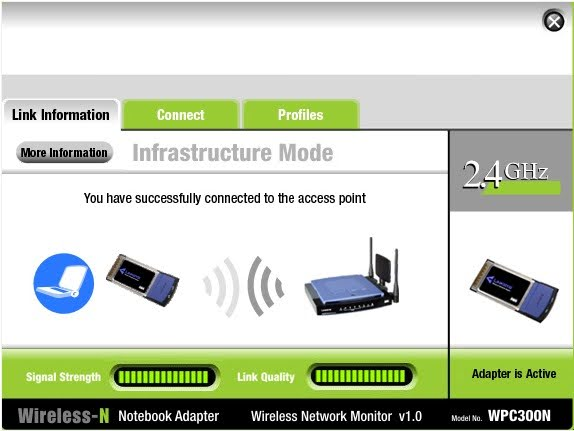
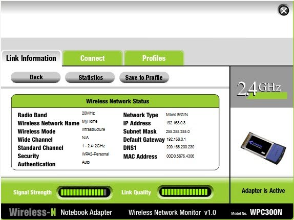
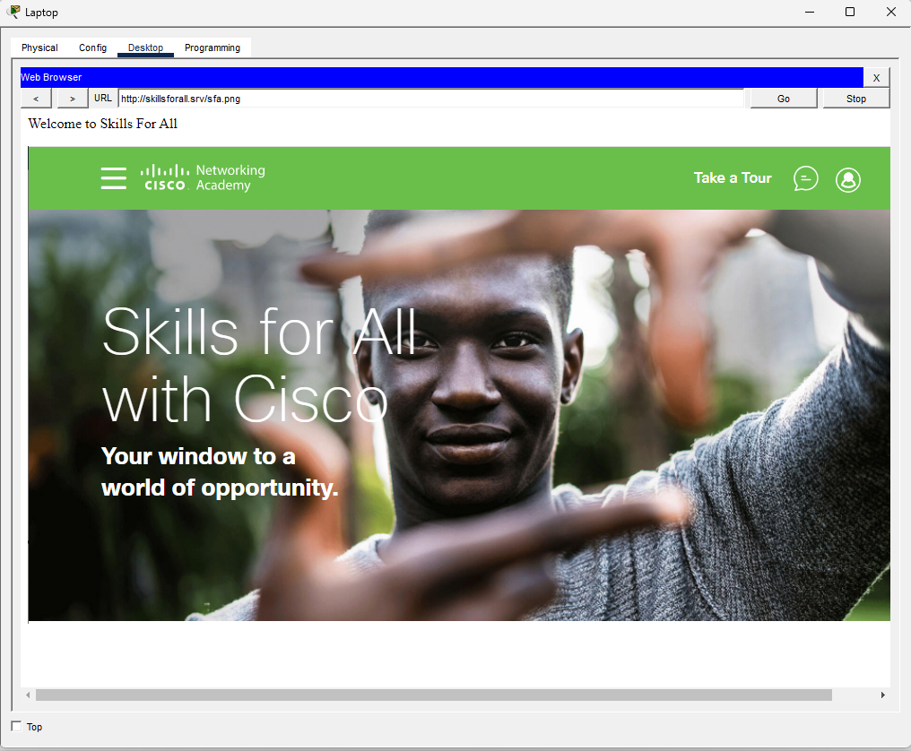
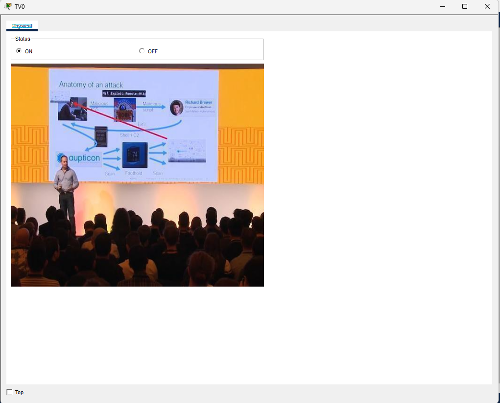
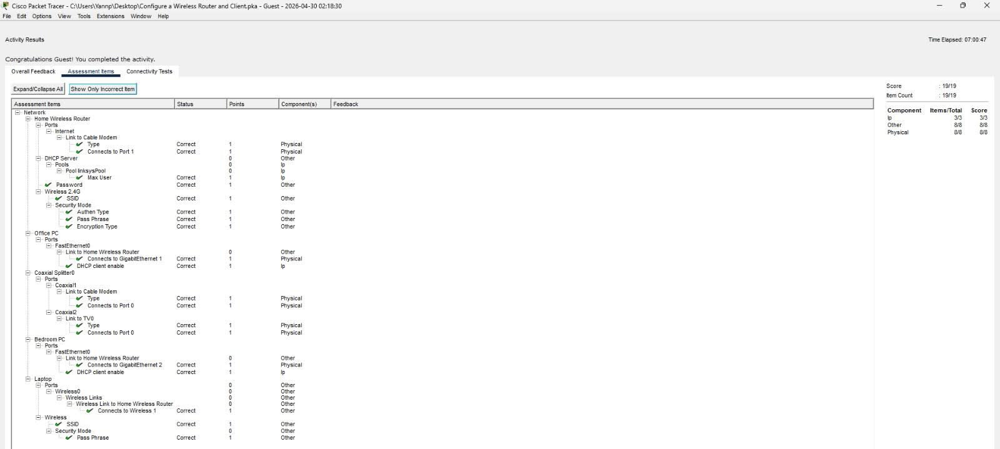

# Activity 4.4.4 - Configure a Wireless Router and Client

## 📋 Objectives
- **Part 1:** Connect the Devices
- **Part 2:** Configure the Wireless Router  
- **Part 3:** Configure IP Addressing and Test Connectivity

## ⚙️ Router Configuration

| Setting | Value |
|---------|-------|
| **SSID (2.4GHz)** | `MyHome` |
| **Security Mode** | `WPA2-Personal` |
| **DHCP Max Users** | `10` |
| **Router IP** | `192.168.0.1` |

> 🔒 **Security Note:** Passphrase and admin credentials are not disclosed for security reasons. In production environments, always use strong, unique passwords and store them in a secure password manager.

## 💻 Device IP Addresses

| Device | IP Address |
|--------|------------|
| Office PC | `192.168.0.2` |
| Laptop | `192.168.0.3` |
| Default Gateway | `192.168.0.1` |

## 📸 Screenshots

| Step | Screenshot | Description |
|------|------------|-------------|
| 1 |  | Physical topology |
| 2 |  | Logical topology with skillsforall.srv |
| 3 |  | Office PC - DHCP enabled |
| 4 |  | Laptop - IP via DHCP |
| 5 |  | Router - SSID "MyHome" |
| 6 |  | Laptop connected to Wi-Fi ✅ |
| 7 |  | Laptop IP: 192.168.0.3 |
| 8 |  | Office PC → skillsforall.srv ✅ |
| 9 |  | Laptop → skillsforall.srv ✅ |
| 10 |  | TV connected and working ✅ |
| 11 |  | Final check - All items correct ✅ |

## ✅ Connectivity Tests

| Test | Result |
|------|--------|
| Office PC → skillsforall.srv | ✅ Successful |
| Laptop → skillsforall.srv | ✅ Successful |
| TV Service | ✅ Working |

## 🎯 Status

- [x] Part 1: Connect the Devices
- [x] Part 2: Configure the Wireless Router
- [x] Part 3: Configure IP Addressing and Test Connectivity

## 🔐 Security Best Practices Applied

- ✅ WPA2-Personal encryption for wireless network
- ✅ DHCP scope limited to 10 users
- ⚠️ Default credentials changed (not disclosed)
- ⚠️ Passphrase configured (not disclosed)

---
*Activity completed: April 2026*  
*Cisco Networking Basics Course*
